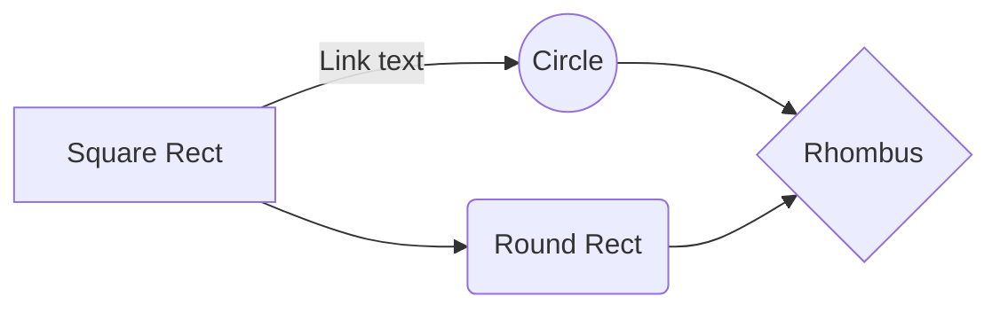

# Nombre del proyecto
Esta es una breve descripción del proyecto en la que se debe mencionar el cliente y las tecnologías usadas, recordar mantener esta descripción breve y diferenciarla de otros productos que pueda tener este cliente, así como puede ser una API o incluso otra página similar a esta.
## Requerimientos de Versiones
* WordPress: 
* PHP: 

Mencionar la versión objetivo de Wordpress, PHP y demás para la que se desarrolló este proyecto, de forma que cualquiera pueda descargar el core de dicha versión y ejecutar el proyecto en cualquer ambiente de desarrollo. Adicionalmente, puedes mencionar el rango de versiones en el que ha sido probado en caso de que se necesite actualizar el core. **Es importante mantener este archivo actualizado, tanto el equipo de Wordpress como cualquier otro que realice cambios a este proyecto, de forma que si se actualiza el core en base a un requerimiento, se vea reflejado aquí.**
## Plugins
En caso de que algún plugin necesite configuración especial o API Keys, se debe dejar por escrito en esta sección para eviar malos entendidos.
## Pagos
En base a sucesos acontecidos se **requiere** que si la página contiene pagos, se deje por escrito en esta sección, además de como verificar visualmente si estos se encuentran activos (**independientemente de si están desactivados, siempre se debe hacer una inspección visual para evitar accidentes**), deshabilitarlos y/o cambiar de ambiente para **evitar cobros automáticos de suscripciones o productos en ambientes que no sean productivos.**
## Otras secciones
Si consideras que debería haber algo más por escrito en este archivo, no dudes en agregarlo, junto a ello y si consideras de que por la naturaleza de Wordpress, todos los proyectos deberían contener esta sección nueva, no dudes en abrir una rama y agregarlo al repositorio de la plantilla o sugerirlo al equipo de Soporte para que lo agreguen, **somos un equipo**.
## Diagramas
A veces es mejor una imágen para visualizar un proyecto, por lo que puedes agregar diferentes tipos de diagramas usando Mermaid. Ejemplo:

## Recursos
[Basic writing and formatting syntax](https://docs.github.com/en/get-started/writing-on-github/getting-started-with-writing-and-formatting-on-github/basic-writing-and-formatting-syntax)  
[Markdown Cheatsheet - Tables](https://github.com/adam-p/markdown-here/wiki/Markdown-Cheatsheet#tables)  
[UML Diagrams in README.md](https://www.freecodecamp.org/news/how-to-add-diagrams-to-github-readme/)  
[KaTeX (Math)](https://katex.org/)  
[Latex rendering](https://stackoverflow.com/questions/35498525/latex-rendering-in-readme-md-on-github)